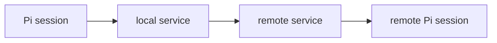

# pi-mesh

[](https://www.npmjs.com/package/@ahkohd/pi-mesh)

P2P mesh for Pi agent sessions.

Each machine runs one local service. Pi sessions register with that service, then agents can send messages or request replies from agents on the same machine or another machine.

## Install

```bash
pi install npm:@ahkohd/pi-mesh
```

## Quick setup

Run the install command on each machine that should join the mesh. If you use Tailscale, make sure `tailscale status` works on each machine.

Then start the mesh from Pi:

```text
/mesh on
```

Check what the local service can see:

```text
/mesh list
```

To join through a known peer, pass its service address:

```text
/mesh on 100.64.0.8:7373
```

## How it works



One service can serve many Pi sessions on the same machine. If a service stops, only that machine drops from the mesh.

Services learn about each other from known peer addresses, connectors, and peer gossip. Once two services make contact, they exchange known peers and agents.

## Commands

```text
/mesh on [peer]
/mesh off
/mesh list
/mesh alias [name]
```

`/mesh on [peer]` starts or connects to the local service, registers the current session, and begins polling for messages. The optional peer is another service address, such as `100.64.0.8:7373`.

`/mesh off` unregisters the current session and stops polling.

`/mesh list` shows this service's address plus local and remote agents it knows about.

`/mesh alias [name]` shows the current alias when called without a name. With a name, it stores a new alias for this session.

## Agent tools

```text
mesh_on(peer?)
mesh_off()
agent_list()
agent_send(to, message)
agent_request(to, message, timeout_seconds?)
```

`mesh_on` registers this Pi session with the local service. With a peer address, it also connects to that peer.

`mesh_off` unregisters this Pi session from the local service.

`agent_list` lists agents known to the local service.

`agent_send` sends a one-way message.

`agent_request` sends a message and waits for the target agent to reply. The default timeout is 30 seconds.

Incoming messages are delivered to the target Pi session as follow-up user messages. For requests, the target agent replies normally; its final assistant message is sent back as the request result.

## Identity

Each agent has a stable id for the Pi session:

```text
sessionid@machine
```

Each agent also has a mutable alias:

```text
name@machine
```

Agents may target either the id or the alias. Alias collisions are rejected.

## Running

Normally, start from Pi:

```text
/mesh on
```

To join through a known peer:

```text
/mesh on 100.64.0.8:7373
```

For one-shot auto-start from the terminal:

```bash
pi --mesh-on
```

On startup it prints the local control address, the network listen address, and the address it advertises to peers:

```text
pi-mesh: control http://127.0.0.1:7372
pi-mesh: listen  http://0.0.0.0:7373
pi-mesh: addr    machine:7373
```

Check a local service:

```bash
curl http://127.0.0.1:7372/health
curl http://127.0.0.1:7372/local/list
```

## CLI

From a terminal or SSH session, use the service CLI:

```bash
npm install -g @ahkohd/pi-mesh
```

```bash
pi-mesh start [peer]
pi-mesh status
pi-mesh list
pi-mesh connectors
pi-mesh peer 100.64.0.8:7373
pi-mesh send clever-otter@mbp "hello from ssh"
pi-mesh request clever-otter@mbp "what are you working on?"
pi-mesh stop
pi-mesh version
```

Add `--json` to commands that return status or data:

```bash
pi-mesh --json status
pi-mesh list --json
pi-mesh request clever-otter@mbp "status?" --timeout 60 --json
```

CLI messages are sent as `cli@machine` by default. Use `--from name@machine` to override it.

For a container or any host without Pi:

```bash
pi-mesh start
```

Then use the `pi-mesh` CLI to reach remote Pi agents.

## Known peers

Known peers are service addresses in `host:port` form.

Sources:

- `/mesh on host:port`
- `pi-mesh start host:port`
- `pi-mesh peer host:port`
- connector discovery events

## Connectors

Core mesh code only knows service addresses. Connectors handle discovery and authorization for a network.

`pi-mesh connectors` lists available connectors. A connector can include optional metadata.

Connector executables are named:

```text
pi-mesh-*
```

For discovery, the service starts each connector like this:

```bash
pi-mesh-example run --port 7373
```

The connector prints newline-delimited JSON events:

```json
{"type":"self","addr":"100.64.0.7:7373","source":"example"}
{"type":"peer","addr":"100.64.0.8:7373","source":"example"}
```

For authorization, the service asks connectors about inbound remote IPs:

```bash
pi-mesh-example auth --remote-ip 100.64.0.8
```

The connector replies:

```json
{"allow":true,"source":"example"}
```

Inbound `/msg` and `/announce` requests are rejected unless they come from loopback, `PI_MESH_INSECURE=1` is set, or a connector allows the remote IP.

Connector docs:

- [Tailscale](docs/connectors/tailscale.md)

## Configuration

| Variable | Default | Description |
| --- | --- | --- |
| `PI_MESH_BIN` | `pi-mesh` | Service executable spawned by the Pi extension. |
| `PI_MESH_CONTROL_URL` | `http://127.0.0.1:7372` | Local control URL used by the Pi extension. |
| `PI_MESH_CONTROL_ADDR` | `127.0.0.1:7372` | Local control API bind address. |
| `PI_MESH_LISTEN_HOST` | `0.0.0.0` | Network API bind host. |
| `PI_MESH_PORT` | `7373` | First network port to try. Ports are scanned through `7399`. |
| `PI_MESH_ADVERTISE` | `<machine>:<port>` | Address announced to peers. If unset, a connector may replace it with a reachable address. |
| `PI_MESH_INSECURE` | unset | Set to `1` to allow non-loopback inbound traffic without connector auth. Use only for local tests. |

## Development

```bash
npm install
cargo check --bins
cargo test
npm run typecheck
npm run build
```
